### WEEK 1 TASK 1 DOCUMENTATION

## Task 1 - Settting up a virtual machine in a network

     To set up the virtual machine in a network, certain processess had to be followed in order for it to work when trying to test the network connectivity. I will detail all the steps taken to set up the network  and the virtual machine.

**Folder Structure**

# Setting up Terraform and AWS
 The first step is to get an IAC to setup the infastructure and the IAC chosen is terraform. I installed the terraform CLI onto my system and steps taken to install are found here:
[Guide to install Terraform](https://developer.hashicorp.com/terraform/tutorials/aws-get-started/install-cli).

Once the CLI was installed I chose my cloud provider of choice which in this case is __AWS__.

**AWS ACCOUNT**

I created my AWS account and according to the universal steps of devops __we do not use our AWS root account to create our infastructure__. I created a new user which is given the admin access to the AWS console and is protected with MFA. 

In the account I then created an access key named terraform in the console:
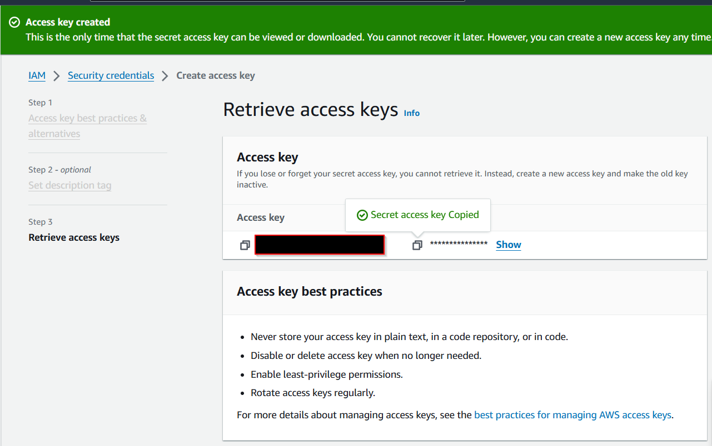

Link to setting up terraform with AWS: [LINKING AWS TO TERRRAFORM](https://developer.hashicorp.com/terraform/tutorials/aws-get-started/aws-build)

Once the access key and secret access key is created and following the steps in the documentation, only different step is instead of the import in my **visual studio code IDE** terminal, 

**$env:AWS_ACCESS_KEY_ID="your_access key"**

**$env:AWS_SECRET_ACCESS_KEY="your_secret_key"**

Once that was done I used the **terraform init** command to initialize terraform with AWS.

# Creating Infastructure in AWS Using Terraform 

The task requires us to create an virtual machines but in order to have connectivity to the machines we have to create a network for the machines to reside. Due to that we have to create a vpc for the machine to reside.

**Creating a VPC**

These are the steps required to create a VPC and bear in mind this is my personal vpc so you would have to create yours to fit your needs. My needs require a machine which is available to the public and one which is not available to the public but certain IP addresses.

Link  to VPC File: [Vpc](./Code/modules/vpc/Vpc.tf) 
- Create the VPC with the CIDR Block of your choosing
- Create an Internet Gateway (This enables connection to the internet)
- Create a Public and private route table 
- Create a public and private subnet (Here is where the machines will reside)
- Associate the route tables with the subnets
- Create a security group with the requires Ingress and Egress rules 
- If a private subnet is being used a NAT gateway will be required in order for the machines or storage to connect to the internet.

This steps make it easy to deploy the VPC and gives me a map to follow when writing up the terrraform code.
Flow Map of the VPC:

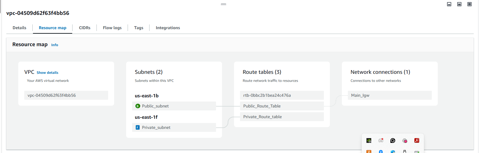

**Creating an Instance**

Link to EC2 File : [EC2](./Code/modules/vpc/Ec2.tf)

Steps Taken to create the EC2:

- Find a suitable AMI for my instance
- Find a suitable instance type
- Create a key pair (this enables us to ssh inte instance)
- For this instance I bootstrapped user data to install apache on the instance
- I attached a network interface to enable communication within the Vpc and also attached a security group to it.
- Place the Ec2 in the public subnet to allow it connect to the internet/ accessible by the internet
- I then attached the network Interface to an Elastic IP address( this prevents the IP address of the instance from changing whenever the instance is restarted)

After configuring the files with terraform I applied it to my aws account using the command **terraform apply --auto-approve** and this tell terraform to apply this infastructure in my AWS console.

Proof of it working :
IP ADDRESS = 52.200.92.54
.png)

### TESTING THE CONNECTIVITY OF THE INSTANCES USING PING

I tested the instance to see if it is able to send packets using the **ping** command in the instance. In order to do this, i connected to the instance from the console or through the VS code terminal:

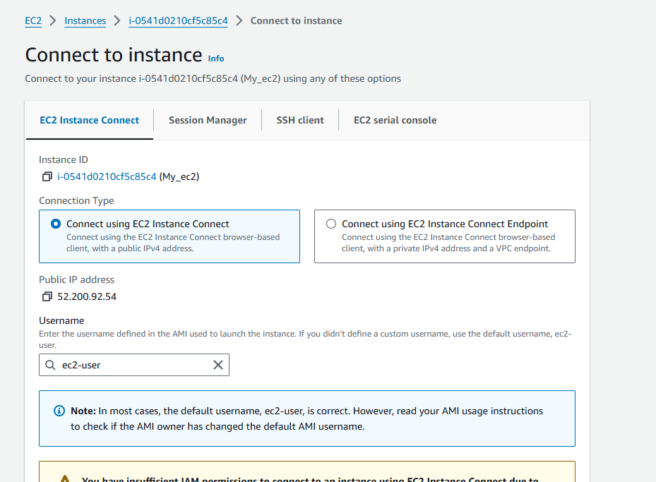

On trying the ping through both modes I could not get a response, i only got a **Request Timed out** error which indicated my security group was blocking ICMP traffic.

**How was I able to determine this**

I was able to determin this dure to the mere fact that once i connected to my instance using the instance connect, i ran **ping 8.8.8.8** (google's DNS) and was able to get a response indicating i could send out ICMP traffic (Ping command is an ICMP traffic command) but could not receive it due to my security group only allowing http and ssh. So i corrected this by including ICMP in my Security group.

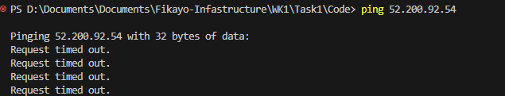

**solved issue picture**

Once the new Security group ingress rule was added, here was what the Ping request returned:

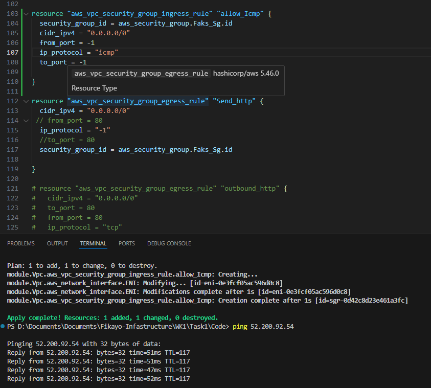

### Accessing the private instance from the Public instance (Bastion Host)

I then SSH into the public instance using putty 

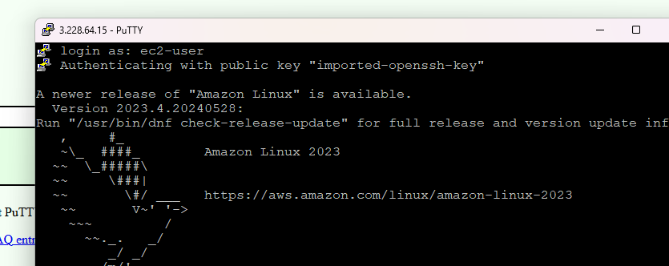.

To SSH into an instance requires fthe following steps 

 - Download the key pair from AWS in a .pem extension
 - Using puttygen, generate a .ppk file using the .pem file downloaded 
 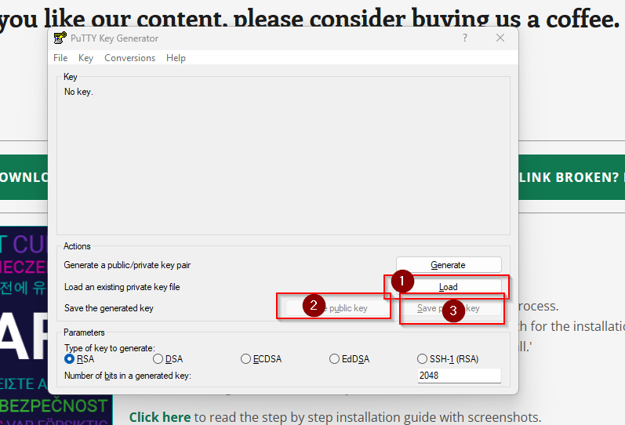
 - Once the key is downloaded, head over to putty and do the following
 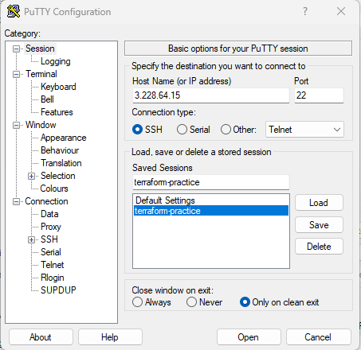
  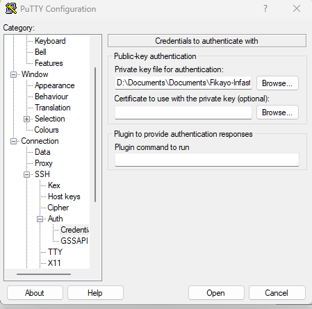

Once I connected to the instance through ssh I Used the ec2 instance to ping the private ec2 instance 
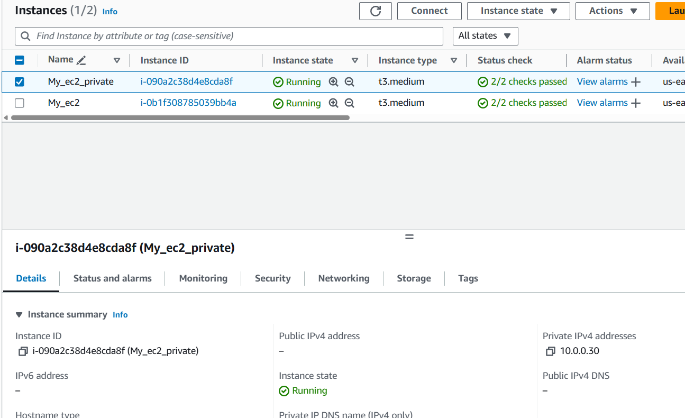
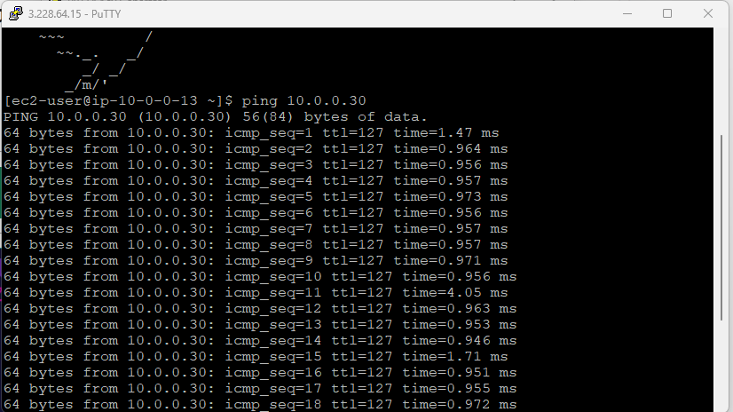

### Installing Wireshark on Public ec2

- SSH into public instance as seen above
- run:
 **sudo yum update** 
 **sudo yum istall wireshark**
 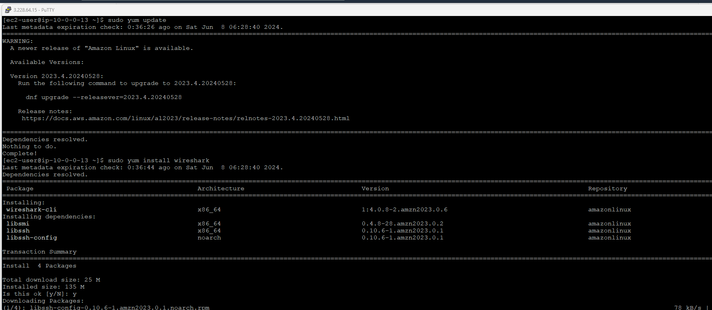

 Once installed, I ran the command :
     **sudo usermod -a -G wireshark ec2-user**
     to add my user to the wireshark group.

I then ran **sudo tshark -i ens5 -f "icmp"** to monitor icmp traffic.

## Test to see if it works 

I pinged the instance from my terminal and saw wireshark pick up the request being sent:
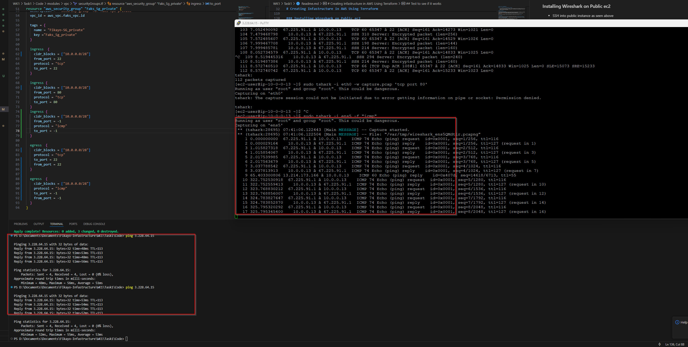

Fikayo Oluwakeye!!!!!!!!!!!!!!!!!!!
