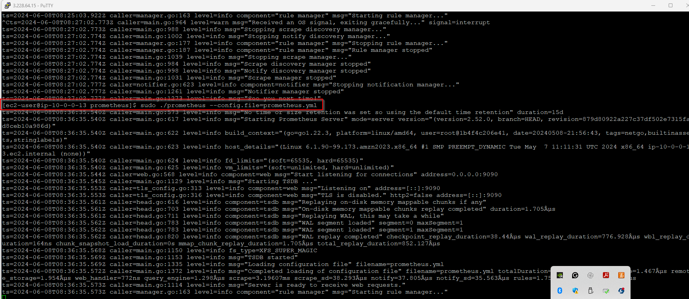

# Welcome to Task 2

I continued from Task 1 and now installing promethues on my ec2 instance created in Task 1.
 

 
## Commands to install Prometheus
 - Get link from prometheus site - [Download Link](https://github.com/prometheus/prometheus/releases/download/v2.52.0/prometheus-2.52.0.linux-amd64.tar.gz)
 - ** wget [promethues](https://github.com/prometheus/prometheus/releases/download/v2.52.0/prometheus-2.52.0.linux-amd64.tar.gz)**
- It gets the download file and saves on the system as a tar.gz file, then i have to extract the file using the command
- **tar xvfv prometheus*.tar.gz**
- Then I moved the folder to the /opt folder using **sudo mv prometheus-2.52.0.linux-amd64 /opt/prometheus** 

- Head over to the folder /opt/prometheus and the **sudo nano prometheus.yml** in order to configure prometheus to scrape dat from my ec2 instance. Here is the configuration I set up :


Then I started prometheus useing **sudo ./prometheus --config.file=prometheus.yml** - this starts up prometheus using the configuration file created.

I then tried accessing prometheus from the website - **http://3.228.64.15:9100/** but was getting errors due to the fact the security group of my ec2 instance did not allow traffic from port 9090. Once the security group was updated, I was able to access the prometheus dashboard



#### Getting Metrics

I the ssh into the provate instance and install node exporter on there to monitor hardawre and os changes.

Steps to install node Exporter
- Wget [Download Link](https://github.com/prometheus/node_exporter/releases/download/v1.3.1/node_exporter-1.3.1.linux-amd64.tar.gz) - Thsi could not connect becuase my private instance has no connection to the internet. This led to me provisioning a NAT gateway to provide internet connection. i ALSO HAD TO MODIFY THE SECURITY GROUP TO ALLOW CONNECTION.
- tar xvfz node_exporter-1.3.1.linux-amd64
- cd node_exporter-1.3.1.linux-amd64

Then run Node exporter
- ./node_exporter &

Once that was up and running, I headed back to the public instance and modified the configuration yml file to watch the private instance this way 

```
  static_configs:
    - targets: ["3.226.211.89:9090"]
  - job_name: "node_exporter_prometheus"
    static_configs:
      - targets: ["10.0.0.30:9100"]

```

I then made sure i had permissions to write to the query file using

```
sudo chown -R ec2-user /opt/prometheus/data
sudo chgrp -R users /opt/prometheus/data

```


Here is promethesu watching the target 


N:B I WAS HAVING ISSUES CONTINUING TO USE MY TERMINAL AS I WOULD HAVE HAD TO STOP RUNNING PROMETHUES I THEN FOUND OUT ABOUT THE & BEHIND THE RUNNING PROMETHEUS COMMAND TO RUN IT IN THE BACKGROUNG

#### Transferring Logs to elastic search

I then installed prometheus elastic search exporter using the following

```
git clone https://github.com/justwatchcom/elasticsearch_exporter.git
cd elasticsearch_exporter
make build
```
***Make build command involved me downloading Make, Go and setting up Go.***
```
sudo yum install make
sudo yum install Go
```

I aslo had to reconfigure the yml file for prometheus

```
scrape_configs:
  - job_name: 'elasticsearch_exporter'
    static_configs:
      - targets: ['localhost:9114']  

```


### Installing Kibana

I followed the steps in the website [Kibana installation](https://www.elastic.co/guide/en/kibana/8.14/rpm.html#rpm-repo)

Once installed I had to configure the yml file for kibana which was found in the directory ***cd /etc***
I then had to change into a super user to access the yml file in the kibana directory using ***Sudo su***

and then added the following config 

```
# Kibana configuration file

server.port: 5601
server.host: "localhost"

elasticsearch.hosts: ["http://localhost:9114"]

```

Then I restarted Kibana using 

```
sudo systemctl restart kibana

To see its status run 
journalctl -u kibana.service

```


This folder is created by the script.Fikayo Oluwakeye
