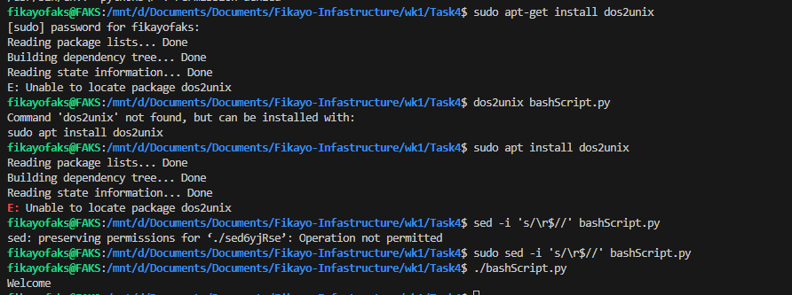

### Creating Bash Scripts 

The first bash script I am creating is a simple bash script that creates a backup for  my task 1 folder in my Task 4  folder

## Steps 
- Write the bash script. Link to Script: [Bash]("./createBackup.sh")
- Make the script executable using **Chmod + x CreateBackup.sh**
- Run the script using **./CreateBackup.sh**

**N.B:** I encountered issues as i use powershell and most of this commands are not supported in powershell which required me to make some more steps outlined below:
 
 - Run terminal as an admin and install Ubuntu 
 - Change my visual studio code terminal settings to include external and integrated terminal 
 - Restart visual studio code and choose **wsl** Terminal 

 Once that was done I tried running the chmod to change the permissions but was restricted due to the file being on the windows platform so i had to change the permission thriugh the file explorer.

 

 Then I ran the script which then automated the task:

 

 ### Using Python For my Bash Scripts

 The previous bash script was using  linus commands but now i switched to python as it is a common language used for scripting.

 The first issue encountered was the line endings of the python file not being recognized by the unix based systems. In order to fix this my first use of **sed** came into effect as it was used to replace any carriage endings in the file.

 Command Used: **Sudo sed -i 's/r\r$//' bashScript.py**

 Sudo was used to give sed elevated priviledges to modifiy the file. dos2unix is a package which can do the same but not available for me at the moment 

 

 My Python script is designed to check all the tasks folder for the week and check if they all have a readme. If any does npt have a readme, it creates one inside the folder.

It also uses commands like grep, sed and awk to make changes to the files.
