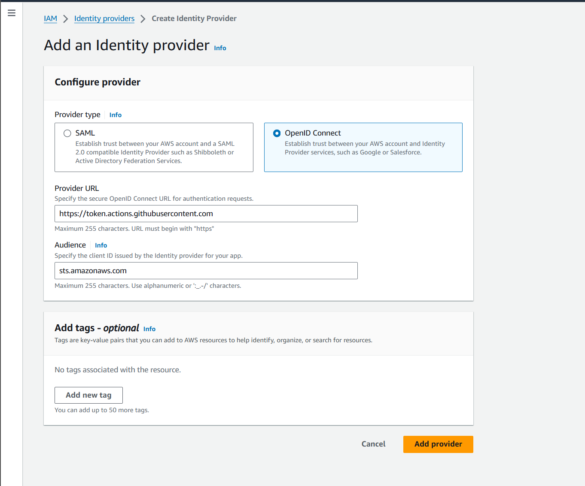
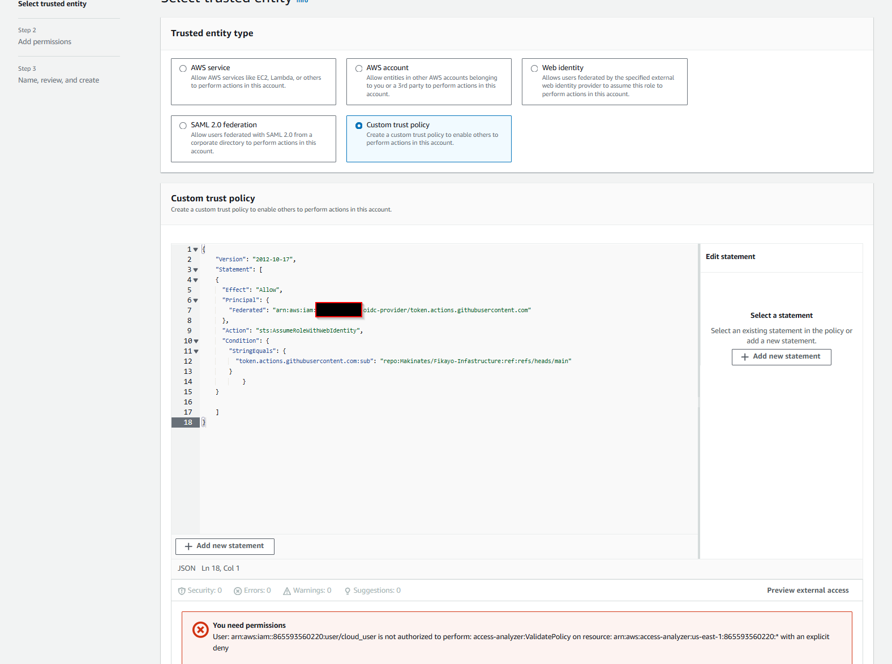
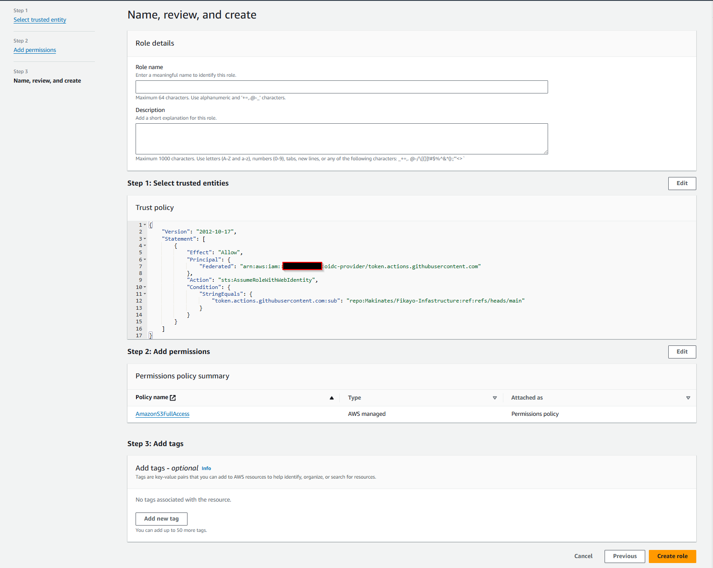
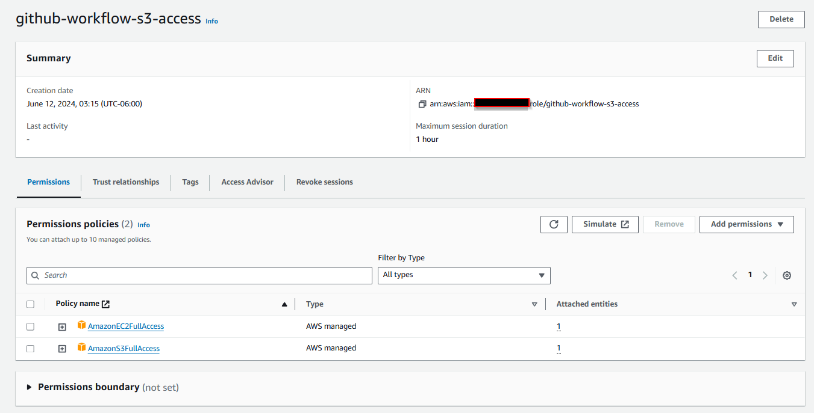
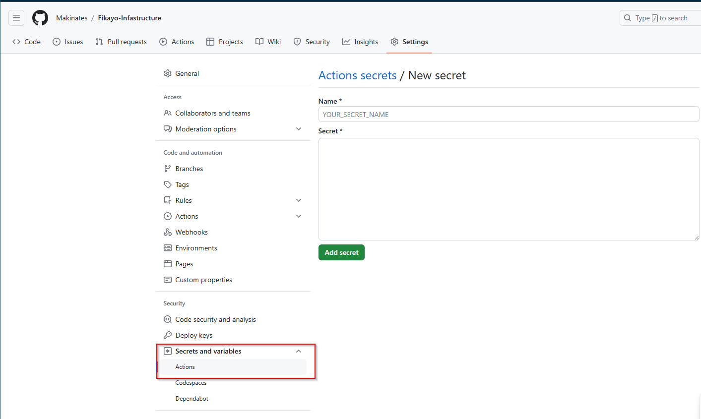
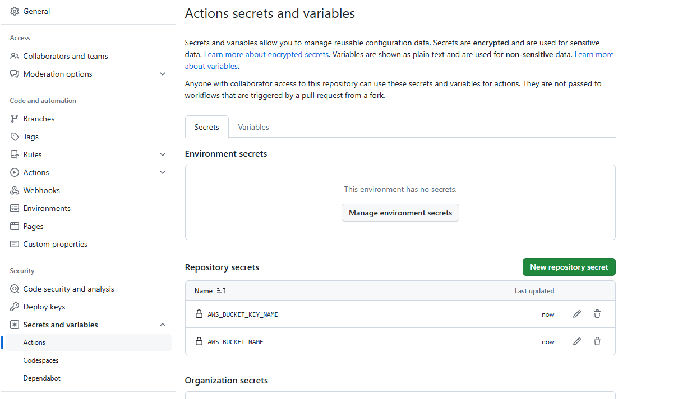

### SETTING UP CI/CD PIPELINE USING GITHUB ACTIONS 

There are various methods to set up a ci/cd pipeline using github actions.
- By including the secret keys of AWS account in the github secrets.
- Assuming a role in AWS (more secure)

I went by step 2 in order to learn more about roles in AWS and below are the steps to authenticate to my AWS account.

### Authenticating to AWS 

- First step was to create an **identity provider** in AWS. What is an identity provider?  [Identity Providers](https://www.okta.com/identity-101/why-your-company-needs-an-identity-provider/). AWS has two provider type: SAML and OpenID.
```
https://token.actions.githubusercontent.com

sts.amazonaws.com
```



- Created a bucket to store my terraform state files.

- Then I created a custoim trust policy which is the role the user will assume when they sign in using their github credentials.

```
{
    "Version": "2012-10-17",
    "Statement": [
        {
            "Sid": "AllowAssumeRoleWithWebIdentity",
            "Effect": "Allow",
            "Principal": {
                "Federated": "arn:aws:iam::{your account id}:oidc-provider/token.actions.githubusercontent.com"
            },
            "Action": "sts:AssumeRoleWithWebIdentity",
            "Condition": {
                "StringEquals": {
                    "token.actions.githubusercontent.com:sub": "repo:fikayodir/githhubFlow:ref:refs/heads/main"
                }
            }
        }
    ]
}

```






### Adding Secrets to Github






### How to create github workflow

In order to create the workflow, we have to create a special directory for the yml file as this is where github will pull from. The folder structure looks like this ***.github/workflows/*.yml**

After the Yml file was created I moved the folder to the root directory and then pushed to my repositiory 


```
server {
        listen 80;
        #listen [::]:80 default_server;

        # SSL configuration
        #
        # listen 443 ssl default_server;
        # listen [::]:443 ssl default_server;
        #
        # Note: You should disable gzip for SSL traffic.
        # See: https://bugs.debian.org/773332
        #
        # Read up on ssl_ciphers to ensure a secure configuration.
        # See: https://bugs.debian.org/765782
        #
        # Self signed certs generated by the ssl-cert package
        # Don't use them in a production server!
        #
        # include snippets/snakeoil.conf;

        root /var/www/360Rides;

        # Add index.php to the list if you are using PHP
        #index index.html index.htm index.nginx-debian.html;

        server_name 54.243.53.221;

        location / {
                proxy_pass http://localhost:5000;
                proxy_set_header Host $host;
                proxy_set_header X-Real-IP $remote_addr;
                proxy_set_header X-Forwarded-For $proxy_add_x_forwarded_for;
                proxy_set_header X-Forwarded-Proto $scheme;
                # First attempt to serve request as file, then
                # as directory, then fall back to displaying a 404.
```