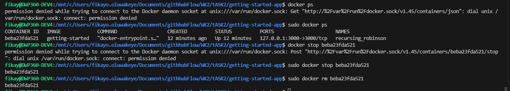
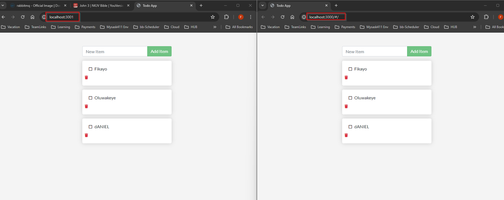
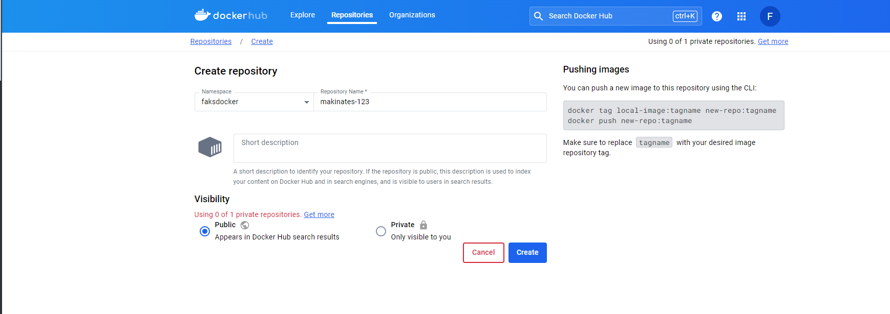
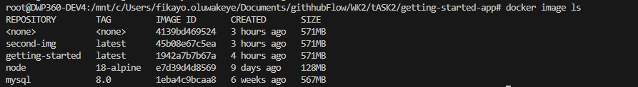
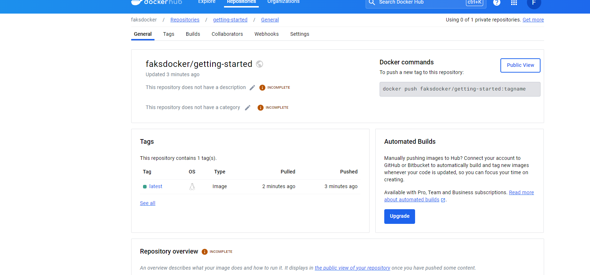

### Docker Containers 

This task involves running an application in a docker conatiner and for this task i will be using a cloned aplication which can be found on the docker website:
[Docker APP](https://github.com/docker/getting-started-app/tree/main)


#### Steps

***LINK TO STEPS I FOLLOWED : [Build a Docker Container](https://docs.docker.com/get-started/02_our_app/)***
 - Clone the Repo into my working directory (This is a Node.js Application)
 ```
 git clone https://github.com/docker/getting-started-app.git
 ```

 - Build the Image by heading into the apps directory same path as the package.json file, then do the following steps:
    - Create a docker file - ```new-item -name DockerFile``` (This is a powershell command). 
    - I switched to wsl to use linux text editors by running ```wsl --install``` 
    - Edit the Docker file using:
    ```
      nano DockerFile

    

      FROM node:18-alpine   #gets a node 18 js image
      WORKDIR /app  #working directory of the container
      COPY . .     # copy all files from current directory to /app
      RUN yarn install --production   # install dependencies
      CMD ["node", "src/index.js"]    # run node src/index.js to start the app
      EXPOSE 3000                     # run on port 3000
    ``` 

    - Build the image ```sudo docker build -t getting-started .```. This involved downloading docker cli to my linux distro and I followed this steps [Install Docker on Ubuntu](https://docs.docker.com/desktop/install/ubuntu/). I had a few errors but ai just had to run the ```sudo apt-get update``` to get past.

    - On building i ran into an error . This is due to me using a capital ***F** to name my docker file instead of a small ***f*** . Renaming my file solved the issue.
    - Now I have an image and its time to create a container.


#### CREATING A CONTAINER 

 - Once the image has been created all that is left is to run the container using ```docker run -dp 127.0.0.1:3000:3000 getting-started```
 
         d- runs the container in the background
         p- creates a port mapping from 127.0.0.1 to localhost:3000 
- Once that was run I headed over to http://localhost:3000/ and was able to see the application.


   #### STOPPING A CONTAINER 
 - Get a list of the running containers using the ```sudo docker ps ```
 - ```sudo docker stop <container id >```
 - ```docker rm <the-container-id>```
 


 #### CREATIVE ASPECT USING VOLUMES

  - Created another to do app with a slight difference and created an image from it but exposed it to port 3001 intead of 3000
  -  Created a volume using the command ```docker volume create todo-db```
  - Then I ran the first container and mounted the volume to it.
  ```
  docker run -dp 127.0.0.1:3000:3000 --mount type=volume,src=todo-db,target=/etc/todos getting-started
  ```
  - This command starts up the container and saves any new todo item to the /etc/todos folder ***inside the container not your linux machine***
  - To connect to an existing/running container use the command 
  ```
  sudo docker exec -it <container name> /bin/sh
  ```
  I used this to make sure the /etc/todo file was actually created 
  - Next I ran the second image on another container and made the local host listen on port 3001
  ```
  sudo docker run -dp 127.0.0.1:3001:3000 --mount type=volume,src=todo-db,target=/etc/todos second-img
  ``` 

  ## IMAGE OF BTH RUNNING SIMULTANEOULSY USING THE SAME VOLUME  
  

  Only drawback is you have to reload the page fo rthe second to get the updated todo list.

   Maybe using a sql db will fix this ???

  ### MULTI CONTAINER APPS USING COMPOSE
  To connect multi containers together in docker they have to be joined to the same network. This example is going to join the todo app to an sql db which is running on anpther container and this will be done by the yaml file and the docker compose.

  - Create a network
  - Create sql database container
  - create application container
  - Join sql database and application container to the network on creation 
  - Connect the application container to the sql container using
  ```
  MYSQL_HOST: mysql
  ```

  Link to compose file: [Compose File](./getting-started-app//compose.yml)

   One might wonder the yml file does not contain your image how is it spinning up the application? Well due to the fact I am in the working directory of the application when i run the comose command it runs the application straight from the directory using the ***yarn run dev*** and does not require an image for my application
  To run the compose file, we use the command: 
  ```
  sudo docker compose up -d
  ```

  To pull it all down we use the command: 
  ```
  sudo docker compose down
  ```

  To see logs of the network:
  ```
  docker compose logs -f
  ```


  #### PUSHING AND PULLING DOCKER IMAGES
  I created a docker account hub for myself and created a repository
   

  To push an Image to the repo I used the command:
  ```
 Example:  docker push faksdocker/<Image-name>

 Actual: docker push faksdocker/getting-started
  ```

  ***This resulted in an error as it could not find any image named getting-started***

  I ran this command to see my docker images 
  ```
  docker images ls 
  ```

  

  My command was looking for an image with the name ***faksdocker/getting-started*** but could not find it which cause the push erro r. In order to fix this I have to rename it to match using 

  ```
  Example: docker tag getting-started YOUR-USER-NAME/getting-started

  Actual: docker tag getting-started faksdocker/getting-started
  ```

   In order to then push, I logged in to docker:
   ```
   Example: docker login -u <your-user-name>

   Actual:  docker login -u faksdocker
   ```
  

  And then ran the original command again.



## CI/CD 