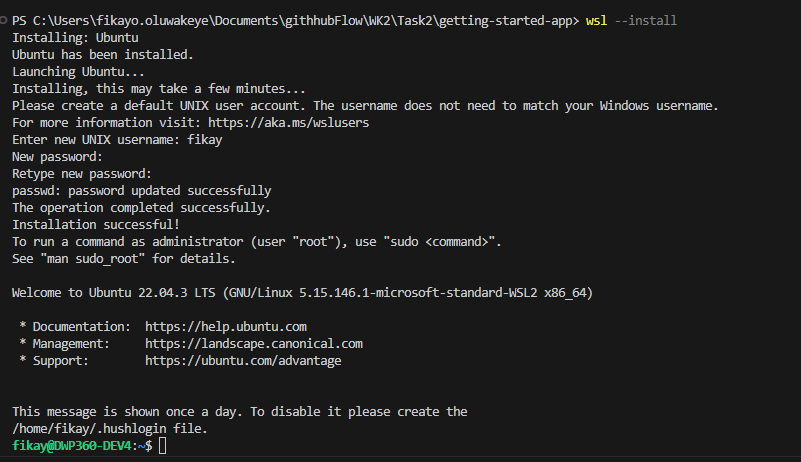
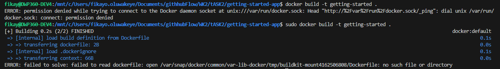
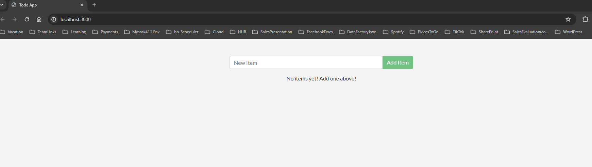
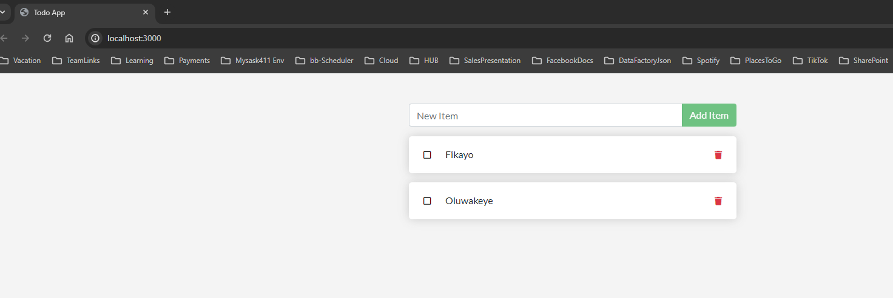

### Docker Containers 

This task involves running an application in a docker conatiner and for this task i will be using a cloned aplication which can be found on the docker website:
[Docker APP](https://github.com/docker/getting-started-app/tree/main)


#### Steps

***LINK TO STEPS I FOLLOWED : [Build a Docker Container](https://docs.docker.com/get-started/02_our_app/)***
 - Clone the Repo into my working directory (This is a Node.js Application)
 ```
 git clone https://github.com/docker/getting-started-app.git
 ```

 - Build the Image by heading into the apps directory same path as the package.json file, then do the following steps:
    - Create a docker file - ```new-item -name DockerFile``` (This is a powershell command). 
    - I switched to wsl to use linux text editors by running ```wsl --install``` 
    - Edit the Docket file using:
    ```
      nano DockerFile

    

      FROM node:18-alpine   #gets a node 18 js image
      WORKDIR /app  #working directory of the container
      COPY . .     # copy all files from current directory to /app
      RUN yarn install --production   # install dependencies
      CMD ["node", "src/index.js"]    # run node src/index.js to start the app
      EXPOSE 3000                     # run on port 3000
    ``` 

    - Build the image ```docker build -t getting-started .```. This invovled downloading docker cli to my linux distro and I followed this steps [Install Docker on Ubuntu](https://docs.docker.com/desktop/install/ubuntu/). I had a few errors but ai just had to run the ```sudo apt-get update``` to get past.

    - On building i ran into an error . This is due to me using a capital ***F** to name my docker file instead of a small ***f*** . Renaming my file solved the issue.
    - Now I have an image and its time to create a container.


#### CREATING A CONTAINER 

 - Once the image has been created al lthat is left is to run the container using ```docker run -dp 127.0.0.1:3000:3000 getting-started```
 
         d- runs the container i nthe background
         p- creates a port mapping from 127.0.0.1 to localhost:3000 
- Once that was run I headed over to http://localhost:3000/ and was able to see the application.

