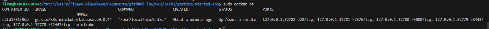
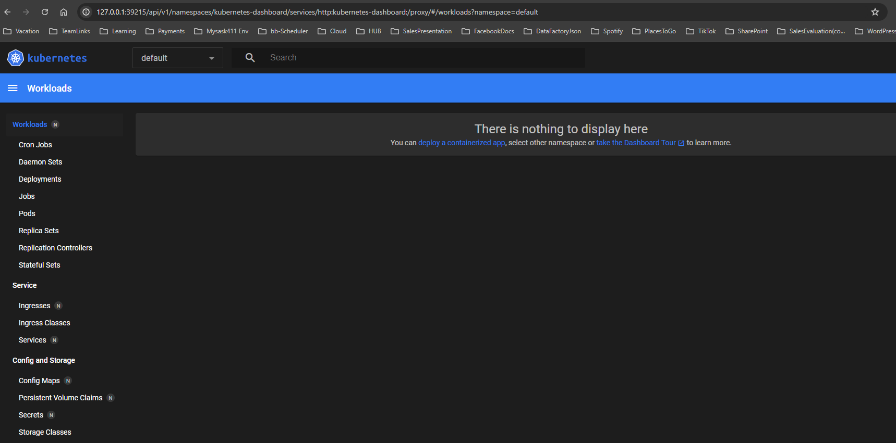
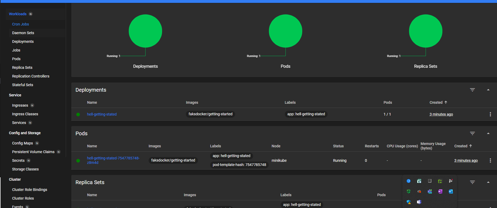
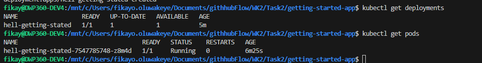
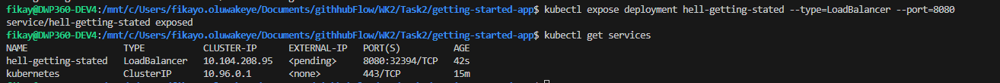
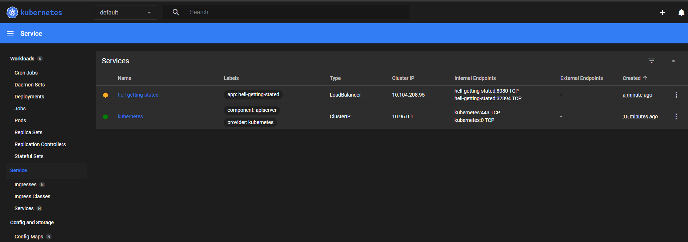
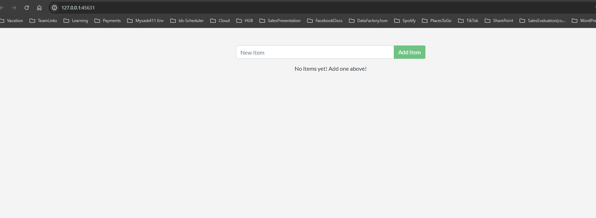
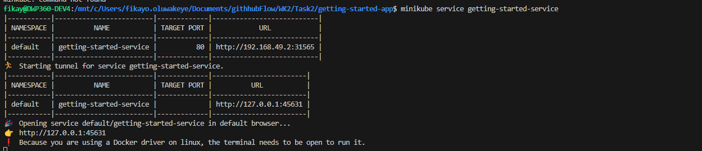

#### KUBERNETES 
 This project will be based on week 2's docker project and from there we will run the docker containerized application on Kubernetes.

 ## STEPS TO INSTALL AND RUN MINIKUBE -[Tutorial link](https://kubernetes.io/docs/tutorials/hello-minikube/)
  - Download minkube to the OS using the wsl terminal [Link to download](https://minikube.sigs.k8s.io/docs/start/?arch=%2Flinux%2Fx86-64%2Fstable%2Fdebian+package)
  - It is a pre-requisite to have docker installed as it will be used with minikube
  -  In order to start minikube I ran this command 
        ```
        minikube start --driver=docker
        ## To delete a minkube container
        minikube delete
        ## To see minkube instances running 
        minikube profile list
        ```
 - That command generated an error 
    ```
    minikube start --driver=docker
    😄  minikube v1.33.1 on Ubuntu 22.04 (amd64)
    ✨  Using the docker driver based on user configuration

        💣  Exiting due to PROVIDER_DOCKER_NEWGRP: "docker version --format <no value>-<no value>:<no value>" exit status 1: permission denied while trying to connect to the Docker daemon socket at unix:///var/run/docker.sock: Get "http://%2Fvar%2Frun%2Fdocker.sock/v1.45/version": dial unix /var/run/docker.sock: connect: permission denied
        💡  Suggestion: Add your user to the 'docker' group: 'sudo usermod -aG docker $USER && newgrp docker'
    ```
- According to the error my user was not added to the docker group so I added it using the command
    ```
    sudo usermod -aG docker $USER && newgrp docker
    ```
    **Bear in mind running the start command also starts a docker container. If you run the sudo docker ps command you will see a docker container running referencing kubernetes. This is as a result of running minkube with a docker engine**
     
- In order to use the Kubernetes dashboard, I ran the command 
    ```
    minikube dashboard
    ```
    
- To get the Kubernetes CLI on the ubuntu terminal I used 
    ```
    sudo snap install kubectl --classic
    ## To see the version installed
    kubectl version --client
    ```
- Create a deployment using the image created in task 2 pushed to docker hub
    ```
    kubectl create deployment hell-getting-stated --image=faksdocker/getting-started

    ## To see deployments 
    kubectl get deployments
    ```
    
    

- By default the deployment is only accessible from the internal ip address within he kubernetes cluster. In order to have it accessible outside the cluster we have to create a service.
    ```
    kubectl expose deployment hell-getting-stated --type=LoadBalancer --port=8080
    ```
    
    

- Running the service using command 
    ```
    minikube service hell-getting-stated
    ```
    On trying to access the local ip address i ran into an error saying ***PAGE IS NOT WORKING***

#### TROUBLESHOOTING
 - I noticed this might have been an issue with the deployment port so I created a new deployment using these commands as my application was exposed on port 3000
    ```
    kubectl create deployment hell-getting-stated --image=faksdocker/getting-started --port=3000
    kubectl expose deployment hell-getting-stated --type=LoadBalancer --port=80 --target-port=3000 --name=getting-started-service
    minikube service getting-started-service
    ```

    
    