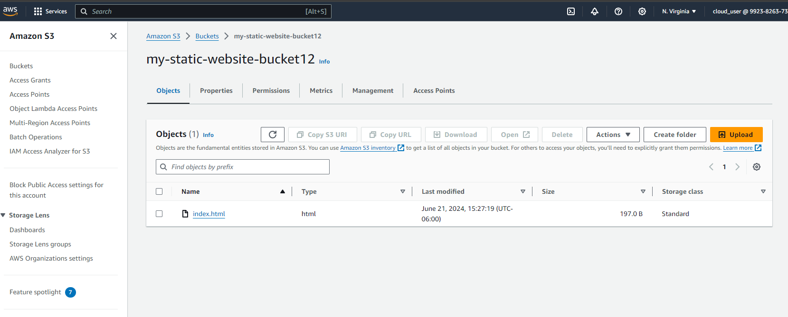

#### WORKING WITH AWS USING THE CLI
[Link to CLI Commands](https://docs.aws.amazon.com/cli/latest/reference/s3/cp.html)

First step was to create or configure the AWS accoun I wanted to connect to by using the 
```
aws configure 
```
command, It will require the Access key,Secret access key, default region name and default output format. To see if I am connnected I use the 
```
aws sts get-caller-identity
```

Now that I have access, I defined what resource I wanted to create which is:
 - An S3 bucket which can host a static website with no public access
 - A cloudfront distribution which can serve the static website being hosted from the s3 bucket using a specific Policy.
 - Create an Origin Access and attach to the cloudFront distro


 ***2nd Project***
 - Launch a vpc with a public subnet 
 - Launch an ec2 instance in a vpc 


 ***Project 1***
  - Launching the s3 Bucket 
  ```
  aws s3api create-bucket --bucket my-static-website-bucket12 --region us-east-1


  ## Upload the index.html file to the bucket
  aws s3 cp index.html s3://my-static-website-bucket12/index.html

  ## Make s3 bucket a static website hosting bucket
  aws s3 website s3://my-static-website-bucket12/ --index-document index.html
  ```



- Create CloudFront Distro
 ```
 #Create OAC
 aws cloudfront create-cloud-front-origin-access-identity --cloud-front-origin-access-identity-config CallerReference=my-oai-$(date +%s) --comment "OAI for my CloudFront distribution"
 
 ```